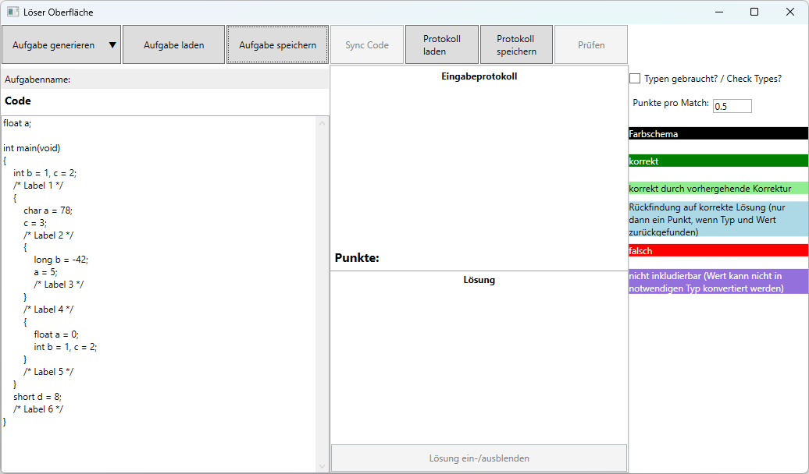

LimitCSolver is a support and learning tool for students who learn the very basics of C programming at [Hochschule Merseburg](https://www.hs-merseburg.de/). The main purpose of the tool is to enable a better understanding of the scoping rules in C programs.

## Project Structure

Written in C# and .NET using Windows Presentation Foundation, the software runs on Windows only.

### Source code is organized as a Visual Studio 2022 Solution including the following projects:

* _LimitCInterpreter_: an interpreter that can understand a tiny fraction of the C programming language (called LimitC), sufficient to check the very basic scoping rules of the language
* _LimitCInterpreter.Test_: the interpreter's test cases (not enough to be honest)
* _MainApplication_: the main UI to load simple C programs and create protocols of the variables states at certain check-points (label comments) and compare with the real values that would occur during program execution
* _ProtocolInputApplication_: a little helper to create task files that can be loaded by the MainApplication
* _LimitCGenerator_: a tool that can generate random LimitC programs to be used as tasks for practicing and improve understanding 

### The project depends on the following NuGet-packages (see license files too):
* CommunityToolkit.Mvvm (License: MIT)
* Newtonsoft.Json (License: MIT)
* Antlr4.Runtime.Standard (License: BSD 3-Clause)

### Contents of the release:
* protsolve.exe: main UI for the labeled memory protocols (variable states at check points)
* protinput.exe: UI to create task files from plain LimitCPrograms 

## Example Task

A memory-protocol task typically has the following shape (the example was taken from our very basic C programming course):
```C
float a;

int main(void)
{
    int b = 1, c = 2;
    /* Label 1 */
    {
        char a = 78;
        c = 3;
        /* Label 2 */
        {
            long b = -42;
            a = 5;
            /* Label 3 */
        }
        /* Label 4 */
        {
            float a = 0;
            int b = 1, c = 2; 
        }
        /* Label 5 */
    }
    short d = 8;
    /* Label 6 */
}
```
The task's main objective is to find out which names are in scope at the `/* Label X */` and which variables (memory locations) are addressed by these names at the label's position. Based on that information and from the computations in the program, students need to determine the actual values of the visible variables at each label and add them to a table (i.e., the _memory protocol_). The table has in each row a label and one column per name of a variable in the program. Considering the program above, the solution looks as follows:
|Position   |   a   |   b   |   c   |   d   | 
|-----------|-------|-------|-------|-------|
|Label 1    |  0.0  |   1   |   2   |   -   |
|Label 2    |  78   |   1   |   3   |   -   |
|Label 3    |   5   |  -42  |   3   |   -   |
|Label 4    |   5   |   1   |   3   |   -   |
|Label 5    |   5   |   1   |   3   |   -   |
|Label 6    |  0.0  |   1   |   2   |   8   |

Checking a solution for correctness is damn simple: one would just need to add a printf statements add each label: `printf("a = %d, b = %d, c = %d", a, b, c)`. Of course, usage of format specifiers depends on types and also some knowledge about visibility rules is required.

So why an extra tool? 

Besides checking for correctness, the program computes points and also can check solutions which are only partially correct by continuing computation with _false_ intermediate values. For example, a student might have guessed wrongly, that the value of `a` at `/* Label 1 */` is _1.0_ instead of _0.0_. If the program was only checked for correctness, the whole solution could be considered wrong, i.e., yielding _0_ of _19_ points. Alternatively, if the value of value of `a` at `/* Label 6 */` also was _1.0_ while the remaining values are correct, that could just yield _17_ of _19_ points by comparing the entries of the tables with the correct values. However, this remains unfair, since if `a = 1.0` at `/* Label 1 */` it should have been `a = 1.0` at `/* Label 6 */` too, which is the correct follow-up value. Hence, the soulution yields _18_ of _19_ points.  This is what the tool can compute and prompt to the student while, e.g., practicing.  

An additional feature of the tool is that it can generate new tasks randomly. So if you just want to do some additional practice, you can just hit a button and a new task is generated.

## Tool usage
The tool consists of two Windows executables. _protinput.exe_ is a helper that converts a plain C program file into a task file. _protsolve.exe_ is the actual tool for loading, generating and practising memory-protocl tasks.

To add a task like the one above to the tool, the program can just be added to the code section and saved (_Aufgabe speichern_, note that the UI currently is German only):



Next to _Aufgabenname_ one may assign the task a name, e.g., 'simple'. This will save a file named 'Aufgabenstellung_simple.lct.json' using a JSON text format, looking basically as follows:

```json
{
    "Name": "simple",
    "Code": "float a;\r\n\r\nint main(void)\r\n{\r\n    int b = 1, c = 2;\r\n    /* Label 1 */\r\n    {\r\n        char a = 78;\r\n        c = 3;\r\n        /* Label 2 */\r\n        {\r\n            long b = -42;\r\n            a = 5;\r\n            /* Label 3 */\r\n        }\r\n        /* Label 4 */\r\n        {\r\n            float a = 0;\r\n            int b = 1, c = 2; \r\n        }\r\n        /* Label 5 */\r\n    }\r\n    short d = 8;\r\n    /* Label 6 */\r\n}",
    "NeedTypes": false,
    "PointForMatch": 0.5,
    "Protokol": { ...
    }
}

```

## Project contributors:

The tool has been written by students of Hochschule Merseburg.

* Lukas Reinicke, first implementation in his bachelor thesis
* Paul Lüttich, coding of the LimitC-Generator in his master thesis
* Sven Karol, supervision and (some) coding 
